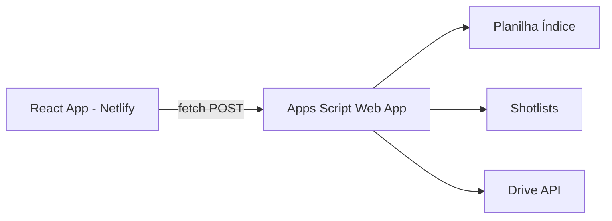

# ScriptToSheet — Plano Frontend Profissional

## Contexto

App de gerenciamento de projetos de roteiro para edição de vídeo. O backend existe em Google Apps Script (`gerenciador.gs`) com CRUD completo. O frontend será um app React + TypeScript independente que consome o backend via HTTP.

## Arquitetura



- **Frontend**: React + TypeScript + Vite + Tailwind + shadcn/ui → Deploy no Netlify
- **Backend**: Apps Script como API REST (doPost recebe JSON, retorna JSON)
- **Comunicação**: Frontend faz `fetch()` pro URL do deploy do Apps Script

## Stack

| Camada | Tecnologia | Motivo |
|--------|-----------|--------|
| **Runtime** | Vite 6 | Rápido, TypeScript nativo |
| **Framework** | React 19 | Padrão de mercado |
| **Linguagem** | TypeScript 5 | Tipagem, autocompletar, robustez |
| **Estilo** | Tailwind CSS 4 | Já no protótipo, utility-first |
| **Componentes** | shadcn/ui | Componentes acessíveis, customizáveis, Gruvbox-friendly |
| **Estado** | Zustand | Leve, sem boilerplate, stores modulares |
| **HTTP** | TanStack Query | Cache, loading states, refetch automático |
| **Ícones** | Lucide React | Ícones profissionais, tree-shakeable |
| **Package Manager** | pnpm | Rápido, disk-efficient |
| **Deploy** | Netlify | Já configurado no ambiente |

---

## Estrutura do Projeto

```
ScriptToSheet/
├── src/
│   ├── components/
│   │   ├── layout/
│   │   │   ├── Sidebar.tsx
│   │   │   ├── Header.tsx
│   │   │   └── Toolbar.tsx
│   │   ├── projeto/
│   │   │   ├── ProjetoList.tsx
│   │   │   ├── ProjetoItem.tsx
│   │   │   └── NovoProjetoModal.tsx
│   │   ├── cena/
│   │   │   ├── CenaTable.tsx
│   │   │   ├── CenaRow.tsx
│   │   │   ├── CenaDetalhePanel.tsx
│   │   │   └── StatusBadge.tsx
│   │   └── ui/               ← shadcn/ui components
│   │       ├── button.tsx
│   │       ├── dialog.tsx
│   │       ├── input.tsx
│   │       ├── select.tsx
│   │       ├── table.tsx
│   │       ├── textarea.tsx
│   │       ├── badge.tsx
│   │       ├── skeleton.tsx
│   │       └── tooltip.tsx
│   ├── stores/
│   │   ├── useProjetoStore.ts
│   │   └── useCenaStore.ts
│   ├── services/
│   │   └── api.ts            ← Fetch wrapper pro Apps Script
│   ├── types/
│   │   └── index.ts          ← Interfaces: Projeto, Cena, StatusType
│   ├── lib/
│   │   └── utils.ts          ← cn(), formatDate(), etc.
│   ├── styles/
│   │   └── globals.css       ← Tailwind base + Gruvbox tokens
│   ├── App.tsx
│   └── main.tsx
├── tailwind.config.ts         ← Cores Gruvbox
├── tsconfig.json
├── vite.config.ts
├── package.json
└── .env                       ← VITE_APPS_SCRIPT_URL
```

---

## Proposed Changes

### Backend (Adaptação)

#### [MODIFY] [gerenciador.gs](file:///e:/Dev/Agente%20Geral/ScriptToSheet/gerenciador.gs)

Adicionar `doPost()` que recebe requisições JSON do frontend:

```javascript
function doPost(e) {
  var body = JSON.parse(e.postData.contents);
  var action = body.action;
  var params = body.params || {};
  var resultado;

  switch (action) {
    case 'listarProjetos': resultado = listarProjetos(); break;
    case 'criarProjeto': resultado = criarProjeto(params.nome, params.docUrl); break;
    case 'listarCenas': resultado = listarCenas(params.sheetId); break;
    case 'atualizarCena': resultado = atualizarCena(params.sheetId, params.linha, params.campos); break;
    // ... demais ações
  }

  return ContentService.createTextOutput(JSON.stringify(resultado))
    .setMimeType(ContentService.MimeType.JSON);
}
```

Adicionar headers CORS no `doGet` pra permitir chamadas cross-origin.

---

### Frontend — MVP

#### Componentes Core (Funcionalidades Ativas)

| Componente | Responsabilidade |
|-----------|-----------------|
| `Sidebar.tsx` | Lista de projetos, seleção, botão "Novo Projeto" |
| `ProjetoList.tsx` | Renderiza lista de projetos da store |
| `ProjetoItem.tsx` | Item individual com ícone + nome |
| `NovoProjetoModal.tsx` | Dialog: nome + URL → chama `criarProjeto` |
| `Header.tsx` | Breadcrumb, busca (desabilitada), ícones |
| `Toolbar.tsx` | Tabs de view + filtros (desabilitados com tooltip "Em breve") |
| `CenaTable.tsx` | Tabela completa com dados do TanStack Query |
| `CenaRow.tsx` | Linha da tabela com status badge + clique pra abrir |
| `CenaDetalhePanel.tsx` | Painel lateral: edição de Status/Tag/OBS, Salvar |
| `StatusBadge.tsx` | Badge colorido baseado no status (Aberto/Layout/Animação/Concluído/Cancelado) |

#### Features Desabilitadas (Em Breve)

Todos com `disabled` + tooltip "Em breve":
- Tabs "Lista" e "Kanban"
- Botões Filtrar, Ordenar, Tags, Exportar
- Busca (input visível mas sem lógica)
- Favoritos na sidebar
- Notificações e Sincronizar no header

---

## Verificação

1. `pnpm dev` → app roda localmente
2. Sidebar carrega projetos do backend
3. Selecionar projeto → tabela carrega cenas
4. Clicar numa cena → painel abre
5. Editar status → salvar → verificar na planilha
6. Criar novo projeto via modal
7. Deploy no Netlify → teste com URL real do Apps Script
